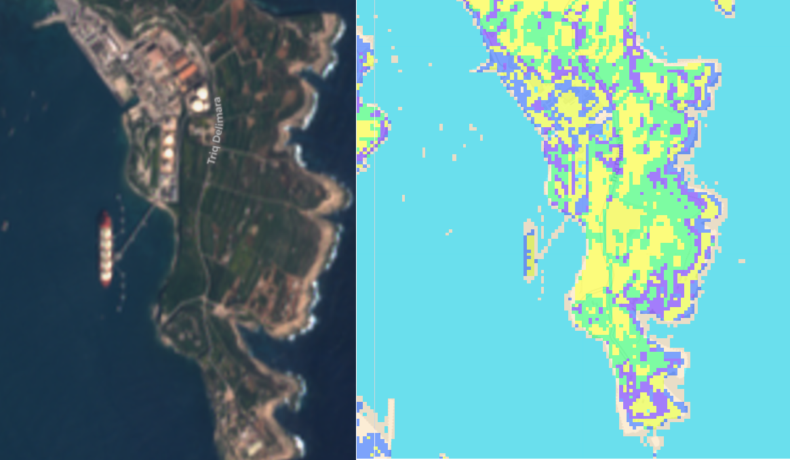
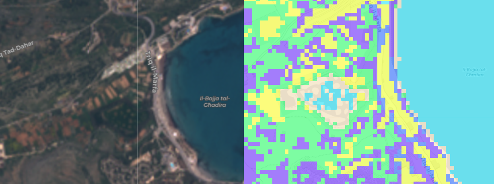

## Introduction: Can we Classify Land Types using R?

A few weeks ago I was looking into what sort of statistics exist on changing land types. I couldn't find much else besides the [CORINE land cover program,](https://land.copernicus.eu/pan-european/corine-land-cover) which is updated every 6 years. At the same time I stumbled across [a fantastic book on using R for just this sort of analysis.](https://www.rspatial.org/rs/index.html)

This blog post will be a short overview of how to use a clustering algorithm on satellite imagery.

## Earth Observation Satellite Imagery

Since satellites are expensive to build, launch and operate, they remain largely the remit of governments, although an increasing number of private operators are gaining traction in recent years. This project used data from two government missions that provide free and high quality data to the general public:

* The joint [NASA and United States Geological Survey Landsat  Mission](https://en.wikipedia.org/wiki/Landsat_8)
* [The EU's Copernicus Mission](https://en.wikipedia.org/wiki/Copernicus_Programme)

The US program operates Landsat 8, while the European program operates two vehicles called [Sentinel](https://en.wikipedia.org/wiki/Sentinel-2). The three satellites are very similar in several ways:

* They are inserted into Sun-synchronous orbits, meaning they always pass a given location on the earth's surface when the sun is at the same angle.

* They have a vast array of electromagnetic sensors that measure the sunlight reflected back by the earth's surface in a number of wavelengths. 

Here's a great one minute infobite from the USGS on how its Landsat 8 orbits the earth:
<iframe width="700" height="394" src="https://www.youtube.com/embed/xBhorGs8uy8" frameborder="0" allow="accelerometer; autoplay; encrypted-media; gyroscope; picture-in-picture" allowfullscreen></iframe>

I'll use imagery from ESA's Sentinel in this post because in theory it should have a higher pixel resolution (10 meters for Sentinel versus 30 meters for Landsat 8). I say in theory because mid-way I realised that downloading the imagery from [the very intuitive GUI here](https://apps.sentinel-hub.com/eo-browser/) would rescale the images on export. In the end the data I worked on had a resolution of around 20 meters per pixel.

## Loading the different layers 

Satellites don't take a photo of the earth in a conventional sense, but rather record the intensity of sunlight reflected back in a number of [bands](https://en.wikipedia.org/wiki/Sentinel-2#Instruments). We load each of these bands in individually from an image taken on the 24th of March 2019.

```{r message=FALSE, warning=FALSE, include=FALSE}
library(raster)

b2 <- raster('C:/Users/Charles Mercieca/Downloads/EO_Browser_images (1)/2019-03-24, Sentinel-2B L1C, B02.tiff')
b3 <- raster('C:/Users/Charles Mercieca/Downloads/EO_Browser_images (1)/2019-03-24, Sentinel-2B L1C, B03.tiff')
b4 <- raster('C:/Users/Charles Mercieca/Downloads/EO_Browser_images (1)/2019-03-24, Sentinel-2B L1C, B04.tiff')
b5 <- raster('C:/Users/Charles Mercieca/Downloads/EO_Browser_images (1)/2019-03-24, Sentinel-2B L1C, B05.tiff')
b8 <- raster('C:/Users/Charles Mercieca/Downloads/EO_Browser_images (1)/2019-03-24, Sentinel-2B L1C, B08.tiff')
b11 <- raster('C:/Users/Charles Mercieca/Downloads/EO_Browser_images (1)/2019-03-24, Sentinel-2B L1C, B11.tiff')
b12 <- raster('C:/Users/Charles Mercieca/Downloads/EO_Browser_images (1)/2019-03-24, Sentinel-2B L1C, B12.tiff')
urban <- raster("C:/Users/Charles Mercieca/Downloads/EO_Browser_images (1)/2019-03-24, Sentinel-2B L1C, False color (urban).tiff")
ndvi <- raster("C:/Users/Charles Mercieca/Downloads/EO_Browser_images (1)/2019-03-24, Sentinel-2B L1C, NDVI.tiff")
```

```{r eval=F, echo=T}
library(raster)
b2 <- raster('2019-03-24, Sentinel-2B L1C, B02.tiff') #blue
b3 <- raster('2019-03-24, Sentinel-2B L1C, B03.tiff') #green
b4 <- raster('2019-03-24, Sentinel-2B L1C, B04.tiff') #red
b5 <- raster('2019-03-24, Sentinel-2B L1C, B05.tiff') #veg red edge
b8 <- raster('2019-03-24, Sentinel-2B L1C, B08.tiff') #NIR
b11 <- raster('2019-03-24, Sentinel-2B L1C, B11.tiff') #swir
b12 <- raster('2019-03-24, Sentinel-2B L1C, B12.tiff') #swir2
```

We can combine these stacks together in creative ways. For instance, creating a natural colour image becomes a matter of laying the blue, green and red layers together:

```{r}
MaltaRGB <- stack(b2, b3, b4)
plotRGB(MaltaRGB, axes = T, stretch = "lin", main = "Sentinel True Color Composite")
```

Different objects have different ways of reflecting light in the different bands. Plants for example absorb most of the light in the visible spectrum to photosynthesise but reemit most of the light in the near-infrared spectrum. This is much different than say a large limestone quarry, that would reflect practically all the light hitting it. Scientists use these differing spectral signatures to create indexes that track all manner of things like vegetation or urbanisation.

I'll use two such indexes below, the normalized difference vegetation index to assess vegetation, and the normalized difference water index, to create a homogenous layer for the sea.

```{r}
NDVI <- (b8-b4)/(b8+b4) #NIR - Red / NIR + Red
NDWI <- (b3-b8)/(b3+b8) #Green - NIR / Green + NIR
plot(NDWI)
```

I've plot NDWI to give you an idea just how these indexes work: anything less than 0.3 is non-water. We'll use this property to construct our water mask, by setting anything that is water to an NA value:
```{r}
water_mask <- NDWI
water_mask[water_mask > 0.3 ] <- NA
water_mask[water_mask <= 0.3 ] <- 1
plot(water_mask)
```

And success! The coastline seems to be accurately represented, and I can even make out Filfla, Cominotto and St. Paul's island. The reason I'm going to such trouble is twofold. Firstly, since I'll eventually run these layers through a clustering algorithm, the reflectance of the sea varies in shallow areas. This step will help avoid classifying two types of sea for instance. Secondly, I'll set the values of the sea to a different homogenous value which I'm hoping will make things easier for the clustering algorithm. 

With that done, let's stack all the raster layers on top of each other. I'll also use the mask function to update all the NA values in the water mask to a single 1 across all the layers.
```{r}
ChosenMetrics<- stack(b2, b3, b4, b5, b8, b11, b12, ndvi, urban)
MaskedBrick <- mask(ChosenMetrics, water_mask, updatevalue = 1)
```

And surprisingly, that's the data preparation done! Time to see what R's base K-Means clustering algorithm can make of the data! The algorithm will operate pixel by pixel, labelling the values across 9 raster layers of each pixel (corresponding to roughly 400m^2) as more similar to one pattern as opposed to another. Just to give you an idea of what the algorithm will "see", here's a random pixel:

```{r}
MaskedBrick[425000]
```

As you can see, band 2 has a value of 0.2335, band 3 of 0.22125, a NDVI of 0.13 etc.

I arbitrarily went with 7 clusters, thinking one for the sea and 6 other land types would be plenty.


```{r}
set.seed(1948)
tic <- Sys.time()
ClusteringLand <- kmeans(MaskedBrick[], centers = 7, iter.max = 500, nstart = 10, algorithm="MacQueen")
toc <- Sys.time()
toc-tic

```

Well, who knew! Turns out Malta is just the right size for my humble laptop to cluster in the time it takes to make a cup of tea! But we'll probably need to buy an Amazon Web Services subscription of we ever want to do it for a whole continent. Now we'll create a single raster layer, and we'll store the results of the k-means classification. All this will contain will be a number from 1 to 7 which identifies to which group that pixel belongs.

The number at this stage is arbitrary. We'll have to come up with labels to what they correspond to ourselves by plotting them.

```{r}
LandClasses <- raster(MaskedBrick[[1]])
LandClasses <- setValues(LandClasses, ClusteringLand$cluster)
plot(LandClasses)
```

For example, it's immediately clear to me that value 3, the orange, is the sea, while value 2, corresponding to the huge Northern Harbour urban fabric is built up environment.. We'll need to zoom in to figure out more accurately what the other ones are. To do this, let's use another awesome R package called leaflet that lets us create interactive maps.

Cluster 7 is obviously the coralline limestone barren of vegetation that you see on the coasts. Cluster 1 looks a lot like garigue, although there are some missclassified pixels in Sliema and Valletta. Cluster 4 seems to be healthy green vegetation, while cluster 5 seems to be dry arable land or ploughed fields. 6 seems to be mostly areas of clear dirt and limestone quarries. 

That being said, there are some errors: some pixels in urban areas are misclassified mostly as vegetation, and surfaces like the Xewkija race track, and quarries near Dingli have been labeled as "sea". Oops. 


```{r message=FALSE, warning=FALSE}
library(leaflet)
library(leaflet.extras)


pal <- colorFactor(topo.colors(7), values(LandClasses))

leaflet() %>% addTiles() %>%
  addProviderTiles(providers$CartoDB.Positron) %>% 
  addRasterImage(LandClasses, colors = pal, opacity = 0.5, project = F) %>%
  addLegend(pal = pal, values = values(LandClasses),
            title = "LandCategory") 

```


## Fun things to see 

At this stage, I was really over the moon with my interactive map, misclassified pixels or not, so I decided to set off exploring. In fact, my giddiness reminded me of an old Eliot line that seemed apt.

> We shall not cease from exploration, and the end of all our exploring will be to arrive where we started and know the place for the first time. ~ T.S. Eliot

Here are a few of my highlights:

# Armada LNG off Delimara
See, NET told you can see it from space!


# The Ghadira Salt Marsh
I was a bit surprised it got this one right, considering it doesn't even look like water in the image.


# Oops at Ramla
Guess what has nice IR radiation in the mid-day sun? Buildings. You know what else? Sandy beaches.


## Things I Could have of done better

I didn't really pay much attention to picking the best clustering algorithm, or even optimizing the very basic one I did. I'd probably get a better result if I went with say more clusters and merged the ones that are classifying the same thing while maintaining the ones that managed to give accurately nuanced land types.

Supervised learning with samples of labelled land types would also be a good approach.